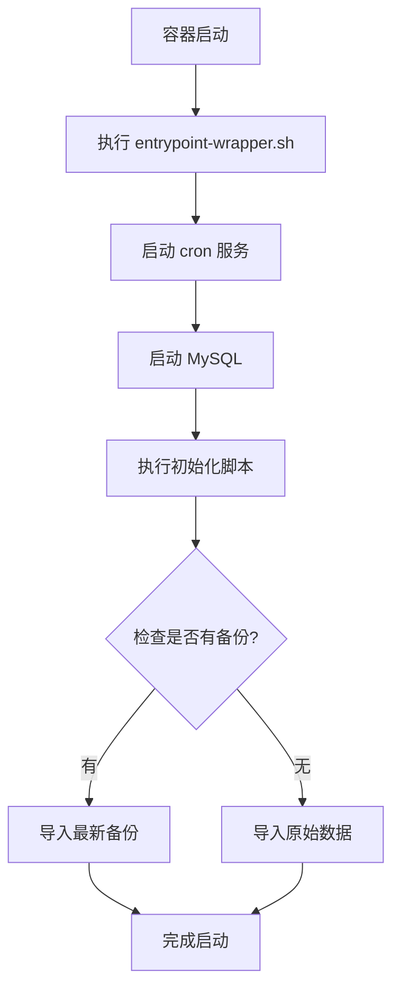

# MySQL 自动备份系统

## 概述

本系统提供了完整的 MySQL 数据库自动备份和恢复解决方案：

- ✅ **自动定时备份**: 每天凌晨 2 点自动备份，每周日额外备份
- ✅ **智能数据导入**: 启动时自动导入最新备份，无备份时使用原始数据
- ✅ **备份保留策略**: 自动清理 30 天前的旧备份
- ✅ **压缩存储**: 备份文件自动 gzip 压缩，节省空间

## 目录结构

```
docker/mysql/
├── Dockerfile              # 自定义 MySQL 镜像
├── init/                   # 数据库初始化脚本目录
│   ├── 01-init.sql        # 基础初始化
│   ├── 02-data-final.sql  # 原始数据备份
│   └── 99-restore-backup.sh # 智能数据导入脚本
├── scripts/               # 备份脚本目录
│   ├── backup.sh          # 自动备份脚本
│   ├── crontab            # Cron 定时任务配置
│   ├── entrypoint-wrapper.sh # 容器启动脚本
│   └── start-cron.sh      # Cron 启动脚本（备用）
└── README.md              # 本文档

docker/backups/            # 备份文件存储目录（Docker 挂载）
```

## 工作原理

### 1. 容器启动流程



### 2. 自动备份流程

- **定时执行**:
  - 每天凌晨 2:00 执行备份
  - 每周日凌晨 3:00 额外备份

- **备份内容**:
  - 完整数据库导出
  - 包含存储过程、触发器、事件
  - Gzip 压缩

- **保留策略**:
  - 保留最近 30 天的备份
  - 自动删除过期备份

### 3. 智能数据导入

容器首次启动或数据库为空时：

1. 检查 `/backups` 目录是否有备份文件
2. 如果有备份，导入**最新的**备份文件
3. 如果无备份，导入 `02-data-final.sql` 原始数据
4. 如果两者都没有，数据库保持为空

## 使用方法

### 启动服务

```bash
# 构建并启动所有服务
docker-compose up -d

# 仅重启 MySQL 服务
docker-compose restart mysql

# 查看 MySQL 日志
docker-compose logs -f mysql
```

### 手动备份

```bash
# 进入 MySQL 容器
docker-compose exec mysql bash

# 手动执行备份
/scripts/backup.sh

# 查看备份文件
ls -lh /backups/
```

### 手动恢复

```bash
# 恢复特定备份文件
docker-compose exec mysql bash
gunzip -c /backups/backup_20241005_020000.sql.gz | mysql -u react_blog -p react_blog

# 从宿主机恢复
gunzip -c ./docker/backups/backup_20241005_020000.sql.gz | docker-compose exec -T mysql mysql -u react_blog -p react_blog
```

### 查看定时任务

```bash
# 查看当前 crontab 配置
docker-compose exec mysql crontab -l

# 查看备份日志
docker-compose exec mysql tail -f /var/log/mysql-backup.log
```

### 测试备份系统

```bash
# 1. 启动服务
docker-compose up -d mysql

# 2. 等待 MySQL 启动完成
docker-compose logs -f mysql

# 3. 手动执行一次备份测试
docker-compose exec mysql /scripts/backup.sh

# 4. 验证备份文件
docker-compose exec mysql ls -lh /backups/

# 5. 测试恢复（可选）
docker-compose down -v  # 删除数据
docker-compose up -d    # 重新启动，应自动导入最新备份
```

## 备份文件命名规则

```
backup_YYYYMMDD_HHMMSS.sql.gz
```

示例：
- `backup_20241005_020000.sql.gz` - 2024年10月5日 02:00:00 的备份
- `backup_20241006_030000.sql.gz` - 2024年10月6日 03:00:00 的周备份

## 配置调整

### 修改备份时间

编辑 `scripts/crontab`:

```cron
# 每天凌晨 3 点备份
0 3 * * * /scripts/backup.sh >> /var/log/mysql-backup.log 2>&1
```

### 修改保留天数

编辑 `scripts/backup.sh`:

```bash
KEEP_DAYS=30  # 修改为需要的天数
```

### 添加备份到远程存储

可以在 `backup.sh` 中添加：

```bash
# 备份到 S3 / OSS
aws s3 cp "$BACKUP_FILE" s3://your-bucket/backups/

# 或备份到远程服务器
scp "$BACKUP_FILE" user@remote:/path/to/backups/
```

## 故障排查

### 备份未执行

```bash
# 检查 cron 服务状态
docker-compose exec mysql service cron status

# 检查 cron 日志
docker-compose exec mysql grep CRON /var/log/syslog

# 手动测试备份脚本
docker-compose exec mysql bash /scripts/backup.sh
```

### 初始化失败

```bash
# 查看初始化日志
docker-compose logs mysql | grep "restore-backup"

# 检查备份文件权限
docker-compose exec mysql ls -la /backups/
docker-compose exec mysql ls -la /docker-entrypoint-initdb.d/
```

### 恢复失败

```bash
# 检查备份文件完整性
docker-compose exec mysql gunzip -t /backups/backup_*.sql.gz

# 手动解压查看内容
docker-compose exec mysql gunzip -c /backups/backup_*.sql.gz | head -50
```

## 安全建议

1. **密码保护**: 确保 `.env` 文件中的数据库密码安全
2. **备份加密**: 生产环境建议对备份文件加密
3. **访问控制**: 限制 `/backups` 目录的访问权限
4. **远程备份**: 重要数据应同时备份到远程存储
5. **定期测试**: 定期测试备份恢复流程，确保备份可用

## 监控建议

1. **备份监控**: 监控备份文件的生成时间和大小
2. **磁盘空间**: 监控备份目录的磁盘使用情况
3. **日志监控**: 监控备份日志中的错误信息
4. **告警配置**: 备份失败时发送告警通知

## 技术说明

### 基础镜像

本 Dockerfile 基于 `mysql:8.0` 官方镜像构建，该镜像使用 **Oracle Linux** 作为基础系统。

**重要**:
- 包管理器: `microdnf`（不是 `apt-get`）
- Cron 包名: `cronie`（不是 `cron`）
- Cron 命令: `crond`（不是 `cron`）

### 已知问题

如果遇到 `apt-get: command not found` 错误，说明 Dockerfile 使用了错误的包管理器。MySQL 8.0 官方镜像基于 Oracle Linux，需要使用 `microdnf` 而非 `apt-get`。

## 更新日志

- **2024-10-05**: 初始版本
  - 实现自动定时备份
  - 实现智能数据导入
  - 添加备份保留策略
  - 修复包管理器兼容性问题（Oracle Linux）
